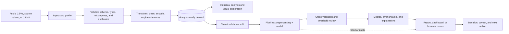

# Kundai Nelly Semu | Systems Engineering & Data Analytics

[](https://developer.mozilla.org/en-US/docs/Web/HTML)
[](https://developer.mozilla.org/en-US/docs/Web/CSS)
[](https://developer.mozilla.org/en-US/docs/Web/JavaScript)
[](https://www.python.org/)
[](https://www.postgresql.org/)
[](https://pandas.pydata.org/)
[](https://scikit-learn.org/)
[](LICENSE)

> **A portfolio built around the work beneath the chart:** reliable systems, inspectable data, honest metrics, and interfaces that make analysis usable.

This repository is the source for the single-page portfolio of **Kundai Nelly Semu**, a Harare-based systems engineer and data analyst. It presents six public-dataset projects spanning predictive modeling, people analytics, customer retention, lending decisions, house-price estimation, and a small event-management application.

The portfolio is intentionally more than a gallery. Each case study documents the path from raw data to decision, including broken source logic, feature-quality concerns, evaluation choices, model caveats, and an interactive browser demonstration where appropriate.

## Contents

- [Executive Summary](#executive-summary)
- [Business and Analytical Problem](#business-and-analytical-problem)
- [Portfolio KPIs and Findings](#portfolio-kpis-and-findings)
- [Data-to-Decision Architecture](#data-to-decision-architecture)
- [Analytical Methodology](#analytical-methodology)
- [Case Study Portfolio](#case-study-portfolio)
- [Technology Stack](#technology-stack)
- [Repository Structure](#repository-structure)
- [Run Locally](#run-locally)
- [Quality, Accessibility, and Performance](#quality-accessibility-and-performance)
- [Future Roadmap](#future-roadmap)
- [License](#license)

## Executive Summary

| Dimension | Executive takeaway |
| --- | --- |
| **Audience** | Technical leaders, analysts, hiring teams, and collaborators who need both analytical judgment and operational awareness. |
| **Business value** | Converts public datasets and flawed source analyses into decision-ready narratives, reproducible model comparisons, and usable interfaces. |
| **Engineering value** | Applies database thinking, validation, explicit assumptions, and deployment-minded interfaces rather than stopping at a notebook output. |
| **Delivery format** | A fast static site with embedded chart previews, accessible interactions, and in-browser demonstrations of selected fitted models. |
| **Current status** | Portfolio showcase complete; source notebooks, raw datasets, and production model artifacts are intentionally not part of this static-site repository. |

## Business and Analytical Problem

The recurring problem across the portfolio is not simply *"which model scores highest?"* It is:

> **How do we move from imperfect operational data to a decision that a person can inspect, challenge, and act on?**

That requires four connected disciplines:

1. **Data engineering:** ingest source tables or flat files, profile types and missingness, validate the schema, and create a trustworthy analytical input.
2. **Analysis:** test whether apparent relationships are meaningful, quantify class balance and outliers, and define a business-relevant evaluation question.
3. **Data science:** build leakage-aware pipelines, compare baselines with alternatives, tune thresholds where the cost of errors matters, and explain the result.
4. **Delivery:** expose the result through a report, dashboard, or application whose inputs match the fitted model and whose limitations are visible.

## Portfolio KPIs and Findings

The figures below are the headline results documented in the portfolio. They are reported with the dataset context and metric definition so they are not mistaken for universal production guarantees.

| Project | Data scale | Primary result | Interpretation |
| --- | ---: | --- | --- |
| Diabetes risk screening | 10,000 patient records | **0.9995 CV ROC-AUC** | Extremely high separation is expected because the label is constructed from diagnostic features; it is not evidence of clinical deployment readiness. |
| Employee attrition | 1,470 employees; 237 leavers | **0.829 CV ROC-AUC**, **0.68 test recall** | Logistic Regression was the strongest of four compared classifiers for this rebuild, with attention paid to the minority class. |
| Telecom churn | 7,032 cleaned customers | **0.80 recall**, **0.84 ROC-AUC**, **26.6% churn** | The model supports a retention conversation; contract length is the most actionable signal in the documented analysis. |
| Credit risk decisions | 11 user inputs | **Tuned threshold** | The decision threshold travels with the fitted pipeline so risk appetite can change without rewriting preprocessing code. |
| House-price prediction | 4,600 to 3,692 rows after trimming | **0.737 test R²**, **$107,849 test RMSE** | Ridge Regression generalized better than the tree models tested on this cleaned Seattle-area sample. |
| Event calendar | JSON-backed application | **CSV export and monthly view** | A small end-to-end application demonstrates validation, persistence, reporting, and the path from terminal logic to UI. |

## Data-to-Decision Architecture

The portfolio follows this workflow across its case studies. The current repository implements the presentation and browser demonstration layers; the upstream analysis is represented through the documented methods and findings rather than checked-in raw data or notebooks.



### Data engineering controls

- **Schema first:** confirm categorical, numeric, boolean, date, and target columns before feature selection.
- **Transformation in the pipeline:** keep encoding, scaling, and resampling attached to model training so validation data does not influence preprocessing.
- **Data-quality checks:** investigate coercion failures such as `TotalCharges` arriving as text, silent dtype assumptions, compounded outlier filters, and missing-value imputation populations.
- **Artifact alignment:** make the application submit the same feature set the model was trained on; avoid hardcoded placeholders and cosmetic form fields.
- **Reproducible decisions:** carry thresholds and documented assumptions beside the fitted model where the decision rule depends on them.

<details>
<summary><strong>Example analytical schema</strong></summary>

The case studies use different source schemas. This compact contract shows the classes of fields that the analytical layer must preserve before modeling.

| Field group | Example fields | Type | Validation / treatment |
| --- | --- | --- | --- |
| Identifier | customer, employee, or record ID | string / integer | Retain for traceability; exclude from training unless justified. |
| Target | churn, attrition, diabetes outcome, price | boolean / numeric | Define before splitting; check prevalence and label construction. |
| Demographic or profile | age, gender, education, dependents | categorical / numeric | Normalize categories; document imputation and fairness implications. |
| Behaviour or usage | tenure, contract, services, job role | categorical / numeric | Check semantic meaning and leakage risk; encode inside the pipeline. |
| Financial or scale | income, loan amount, square footage | numeric | Inspect units, ranges, skew, and influential outliers. |
| Derived features | ratios, diagnostic flags, log transforms | numeric / boolean | Version the transformation and test it against the raw fields. |

</details>

## Analytical Methodology

### 1. Profile before modeling

The first pass checks shape, dtypes, missingness, class balance, duplicate records, invalid ranges, and whether the target is derived from candidate features. This step caught issues such as boolean columns being skipped by a numeric/object selector and string columns bypassing an intended encoding loop.

### 2. Establish a defensible baseline

Simple baselines make later complexity accountable. The portfolio compares Logistic Regression, regularized linear models, tree ensembles, and boosting approaches where they fit the question. A model is not promoted merely because it is more complex.

### 3. Validate for the decision, not the leaderboard

- Use stratification for imbalanced classification problems.
- Keep SMOTE and other resampling operations inside the training pipeline.
- Use cross-validation for model selection and a held-out test set for the final check.
- Read recall, precision, F1, and ROC-AUC together; headline accuracy can conceal a useless minority-class detector.
- Use RMSE and $R^2$ together for price prediction so both error magnitude and explained variance remain visible.

### 4. Explain and qualify the output

SHAP and partial-dependence analysis are used where they help a non-builder understand a prediction. The documentation also calls out label leakage, unrealistic imputations, sparse geographic groups, and demo-versus-production boundaries. That caveat layer is part of the analytical deliverable, not an afterthought.

## Case Study Portfolio

| # | Case study | Decision question | Approach |
| ---: | --- | --- | --- |
| 01 | **Diabetes risk screening** | Which risk factors contribute to a screening prediction? | Six-model comparison, SMOTE inside five-fold CV, SHAP explanations, and an explicit label-leakage caveat. |
| 02 | **Employee attrition** | Which employees may need retention attention? | Rebuilt encode-to-evaluate pipeline, four classifier comparison, minority-class recall, and feature interpretation. |
| 03 | **Telecom churn** | Which customers are candidates for a retention intervention? | Corrected type handling, balanced Logistic Regression, recall-oriented evaluation, and campaign implication. |
| 04 | **Credit risk decisions** | How should a probability become an approval decision? | `sklearn.Pipeline`, persisted threshold, 11 inputs, and a Streamlit-oriented decision interface. |
| 05 | **House-price prediction** | What price estimate is plausible for a sale? | Controlled outlier trimming, model comparison, Ridge Regression, and error-band-aware browser scoring. |
| 06 | **Event calendar** | Can a small operational tool keep its data and UI logic coherent? | Terminal-first validation, JSON persistence, monthly Plotly view, CSV export, and a Streamlit presentation layer. |

<details>
<summary><strong>Why the project write-ups include bugs and caveats</strong></summary>

Several source analyses contained failures that would have produced misleading confidence if they were only polished visually:

- A feature selector silently excluded eight boolean diabetes risk factors.
- An attrition notebook's modeling section never executed because of undefined variables.
- A churn encoding branch was false for modern pandas string columns.
- A housing model comparison was defeated by indentation, while an outlier filter removed too many records.
- The diabetes target includes diagnostic information also present among the predictors, making the near-perfect score structurally unsurprising.

The portfolio treats finding and explaining these defects as analytical work. It makes the difference between a functioning demo and a trustworthy decision process legible to the reader.

</details>

## Technology Stack

| Layer | Technologies | Role |
| --- | --- | --- |
| Portfolio UI | HTML5, CSS3, responsive layout, CSS custom properties | Semantic, responsive presentation without a frontend framework. |
| Interaction | Modern browser JavaScript, DOM APIs, `localStorage` | Theme switching, filters, dialogs, chart lightboxes, model runners, clipboard feedback, and calendar controls. |
| Analytics | Python, pandas, NumPy, SciPy | Cleaning, feature engineering, statistical tests, and exploratory analysis. |
| Modeling | scikit-learn, imbalanced-learn, SMOTE, XGBoost, LightGBM, CatBoost | Pipelines, resampling, model comparison, classification, and regression. |
| Explainability | SHAP, partial dependence | Feature-level interpretation and communication of model behaviour. |
| Reporting | Streamlit, Plotly, Tableau, Power BI | Interactive applications and recurring business reporting. |
| Data platforms | MySQL, PostgreSQL, JSON, CSV | Querying, persistence, export, and operational data handling. |

<details>
<summary><strong>Browser model runner note</strong></summary>

The static site can demonstrate selected fitted models without a Python runtime. For standardized Logistic Regression, the browser runner uses the exported intercept, coefficients, means, and standard deviations:

```python
z = intercept + sum(weight * (value - mean) / standard_deviation)
probability = 1 / (1 + exp(-z))
```

This is a presentation mechanism for the fitted behavior documented by the project, not a substitute for the original training environment, calibration review, monitoring, or clinical and financial validation.

</details>

## Repository Structure

```text
portfolio/
├── index.html                  # Production entry point and portfolio content
├── assets/
│   ├── css/
│   │   └── styles.css          # Design tokens, layout, responsive rules, themes
│   ├── js/
│   │   └── main.js             # Interactions, accessibility behavior, and runners
│   └── images/                 # Reserved for optimized external image assets
├── Kundai_Nelly_Semu_CV.docx   # Downloadable CV
├── LICENSE                     # MIT license
└── README.md                   # Technical and analytical project documentation
```

Charts are embedded as base64 PNG data inside `index.html`, which keeps the showcase portable and avoids extra requests. New optimized media belongs in `assets/images/`.

## Run Locally

No package installation or build step is required.

### Option 1: Open the entry point

Open `index.html` in a modern browser. This is sufficient for the static content.

### Option 2: Use Python's local server

From the repository root:

```bash
python -m http.server 8000
```

Visit <http://localhost:8000>.

### Option 3: Use VS Code Live Server

Open the repository in VS Code, right-click `index.html`, and select **Open with Live Server**.

<details>
<summary><strong>Development checklist</strong></summary>

```text
1. Open the page at desktop and mobile widths.
2. Toggle light and dark themes; refresh to verify persistence.
3. Filter the project list and open each project dialog.
4. Exercise keyboard focus, Escape/backdrop close, chart enlargement, and model controls.
5. Check the console for runtime errors before deployment.
```

</details>

## Quality, Accessibility, and Performance

- Semantic landmarks, a skip link, visible focus states, labelled dialogs, and live status regions support keyboard and assistive-technology users.
- Reduced-motion preferences are respected in the stylesheet.
- Chart images use lazy loading and descriptive alternative text.
- CSS and JavaScript remain external so the HTML entry point is easier to cache and maintain.
- The site has no runtime dependency on a package manager or server framework.

Before publishing, test keyboard-only navigation, dialog focus management, color contrast, external links, mobile layouts at `320px`, `375px`, and `768px`, and the final canonical URL. Replace the placeholder `kundaisemu.example` metadata in `index.html` before production deployment.

## Future Roadmap

| Priority | Next increment | Why it matters |
| --- | --- | --- |
| 1 | Replace placeholder canonical and Open Graph URLs with the public domain and add a social preview image. | Improves link previews and deployment correctness. |
| 2 | Publish versioned notebooks, data dictionaries, and reproducible environment files in a dedicated analytics repository. | Makes the analytical claims independently rerunnable without bloating the static portfolio. |
| 3 | Rebuild the diabetes model without label-derived predictors. | Tests whether the screening signal survives removal of diagnostic leakage. |
| 4 | Replace the calendar's flat-file persistence with SQLite and stable event IDs. | Supports multiple records, safer updates, and a credible upgrade path. |
| 5 | Add automated HTML, accessibility, link, and visual regression checks. | Protects the portfolio as content and interactions grow. |
| 6 | Add model cards and monitoring plans for the interactive demos. | Separates illustrative scoring from responsible production deployment. |

## Deployment

### GitHub Pages

1. Push the repository to GitHub.
2. Open **Settings > Pages**.
3. Select **Deploy from a branch**, the production branch, and the `/ (root)` folder.
4. Save and wait for GitHub Pages to publish the site.

### Netlify

Import the repository, leave the build command empty, set the publish directory to `.`, and deploy.

## License

The source code is available under the [MIT License](LICENSE).
